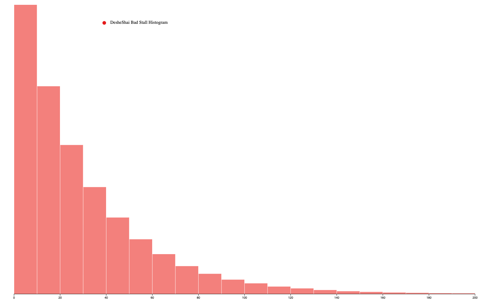
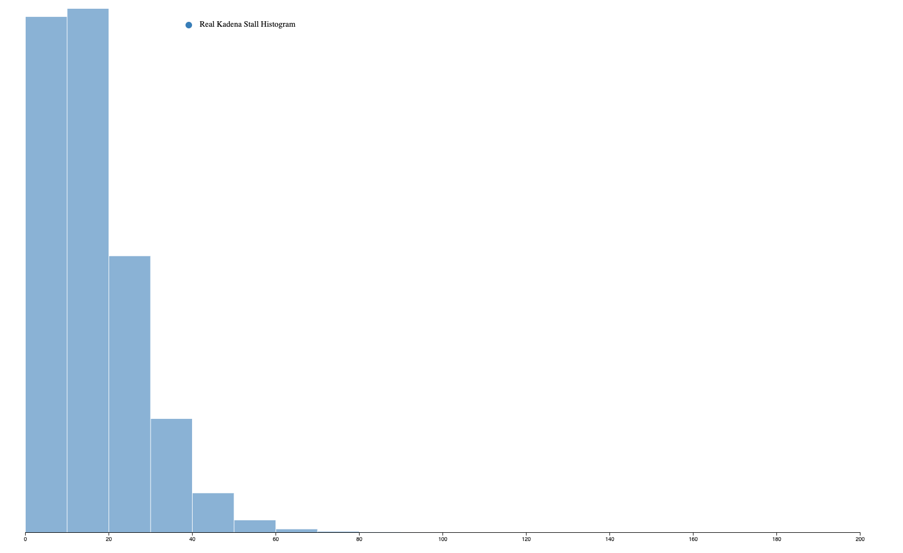
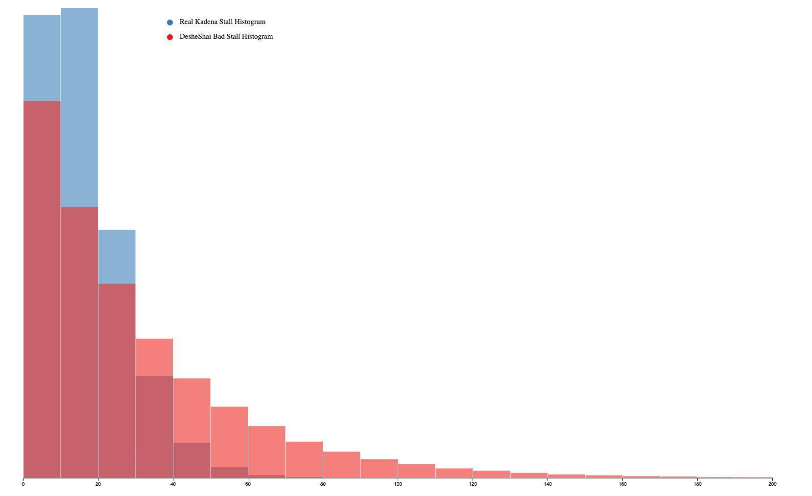
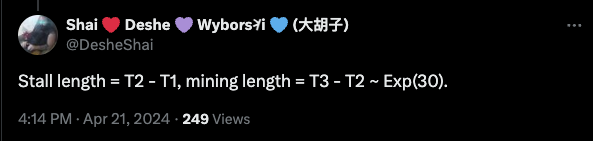

# Analysis of DesheShai's Kadena Simulation

I wanted to see if the Kadena analysis published by @DesheShai on Twitter/X
[1] was accurate or not. His original code is published at [this
link](https://pastebin.fr/136035), and I have included it in
[code-orig.py](code-orig.py) in this repository as well along with other code
and data used in my analysis.

The TL;DR for those not interested in the details is that the analysis is
completely wrong. I have carefully analyzed the code and identified at least
the following problematic points:

1. The approach is unnecessarily complicated. No simulation is needed. The
   graph diameter is 3 blocks and that is the answer to how long it takes for
   a transaction to have the protection of the full network.
2. It does not analyze large enough chain graphs.
3. It chooses chain graphs randomly, rather than carefully chosen the way
   Kadena describes.
4. The random numbers have too many long delays and not enough short delays,
   inflating the numbers and leading to an incorrect conclusion.
5. When I change it to use realistic random numbers, the simulation results
   match the diameter, confirming above point #1.

Any one of these issues is enough to cast serious doubt on the conclusions.
All of them combine to completely discredit his analysis.

He has offered a bounty of 500k KAS for anyone able to debunk his analysis and
promised to post an apology.


@DesheShai, I proved you wrong. Pay up. My Kaspa wallet address is
`kaspa:qz4xvqeeewz83nagrf97wz2d0v7uydwjxpmj2ts27et7watan6vjg2wxjyhs4`.

Without further ado, let's dig into the details...

## 1. The approach is unnecessarily complicated.

There is no need for a simulation. We know exactly how long it takes for one
block to propagate to all chains. It's the diameter of the chain graph (3 block
heights with Kadena's current 20 chains).

If your transaction is on chain C at block height H, You only have to wait
until all chains have been mined at height H+3 before your transaction has the
security of all 20 chains.

Kadena mentioned this in the Chainweb whitepaper (at least pages 8 and 13).
It's clearly shown in the block explorer when you hover over a block.
Doug mentioned this in [his DCentralCon presentation in Feb
2022](https://www.youtube.com/watch?v=17xKdYot4C8&t=256s).

We can use [the
`doublePetersen()` graph definition](code-orig.py#L5) to see that the diameter is 3
in multiple ways. First, we can simply calculate the diameter:

    >>> nx.diameter(doublePetersen())
    3

Alternatively, we can print the shortest path between every pair of chains with
the following code:

```python
def print_distances(rg):
    print('   ', end='')
    sn = sorted(rg.nodes);
    for n in sn:
        print(f' {n: >2}', end='')
    print()
    print('  +', end='')
    for n in sn:
        print('---', end='')
    print()
    for s in sn:
        print(f'{s: <2}|', end='')
        for t in sn:
            sp = nx.shortest_path_length(rg, source=s, target=t)
            print(f' {sp: 2}', end='')
        print()
```

When we run `print_distances(doublePetersen())`, we get the following output:

         1  2  3  4  5  6  7  8  9 10 11 12 13 14 15 16 17 18 19 20
      +------------------------------------------------------------
    1 |  0  2  1  1  3  2  2  3  3  2  3  1  3  3  3  3  3  2  2  3
    2 |  2  0  3  1  1  2  2  3  3  2  1  3  3  3  2  3  3  3  3  2
    3 |  1  3  0  2  3  3  1  2  3  3  2  2  3  3  3  2  3  3  1  2
    4 |  1  1  2  0  2  1  3  3  3  3  2  2  2  2  3  3  3  3  3  3
    5 |  3  1  3  2  0  3  3  3  2  1  2  2  3  3  3  3  2  3  2  1
    6 |  2  2  3  1  3  0  3  2  2  3  3  3  1  1  3  2  2  3  3  3
    7 |  2  2  1  3  3  3  0  1  2  3  1  3  3  2  2  3  3  3  2  3
    8 |  3  3  2  3  3  2  1  0  1  2  2  3  2  1  3  3  2  3  3  3
    9 |  3  3  3  3  2  2  2  1  0  1  3  2  1  2  3  2  3  3  3  3
    10|  2  2  3  3  1  3  3  2  1  0  3  1  2  3  3  3  3  2  3  2
    11|  3  1  2  2  2  3  1  2  3  3  0  3  3  3  1  2  3  2  3  3
    12|  1  3  2  2  2  3  3  3  2  1  3  0  3  3  2  3  2  1  3  3
    13|  3  3  3  2  3  1  3  2  1  2  3  3  0  2  2  1  3  3  2  3
    14|  3  3  3  2  3  1  2  1  2  3  3  3  2  0  3  3  1  2  3  2
    15|  3  2  3  3  3  3  2  3  3  3  1  2  2  3  0  1  2  1  2  3
    16|  3  3  2  3  3  2  3  3  2  3  2  3  1  3  1  0  3  2  1  2
    17|  3  3  3  3  2  2  3  2  3  3  3  2  3  1  2  3  0  1  2  1
    18|  2  3  3  3  3  3  3  3  3  2  2  1  3  2  1  2  1  0  3  2
    19|  2  3  1  3  2  3  2  3  3  3  3  3  2  3  2  1  2  3  0  1
    20|  3  2  2  3  1  3  3  3  3  2  3  3  3  2  3  2  1  2  1  0

This shows the distance from any chain to any other chain. The largest number
here is 3, confirming the diameter calculation above, and it tells us how many
blocks it takes before the entire network hash power secures any single
transaction.

## 2. Are Kadena's block times actually 30 seconds?

In DesheShai's analysis, sometimes he talks about block delays and sometimes he
talks about time delays. One might ask if each block height really takes 30
seconds as advertised. Let's examine that.

As is commonly known by anyone familiar with proof of work networks, block
delays can vary. So how much do Kadena blocks vary? This is easy to verify by
looking at Kadena's block explorer.

The first block on chain 0 mined in 2023 was block height 3336687. We can find
this block in Kadena's block explorer
[here](https://explorer.chainweb.com/mainnet/chain/0/height/3336687). The first
block on chain 0 mined in 2024 (one year later) was block height 4387493, as you
can see [here](https://explorer.chainweb.com/mainnet/chain/0/height/4387493).
When we calculate 4387493 - 3336687, we see that 1,050,806 block heights passed
in one year. The number of seconds in a year is 60 * 60 * 24 * 365 = 31,536,000.
Now calculate 31536000 / 1050806 = 30.01125. This is remarkably close to the
expected 30 seconds (less than 0.04% error).

From this we see that the estimate of 30 seconds per block height is indeed very
accurate. Three block heights with a 30 second block time works out to
approximately 90 seconds, much less than the eight block delays or four minutes
claimed by DesheShai.

## 3. DesheShai does not analyze large enough chain graphs.

He only analyzes 100 chains. That is not sufficient to answer the scalability
question. You have to look at what happens with tens of thousands of chains or higher.

Thanks to the analysis above, we know exactly what this is. You can get tens
of thousands of chains with a degree and diameter of 7 (as well as other
choices of degree and diameter as can be seen
[here](https://en.wikipedia.org/wiki/Table_of_the_largest_known_graphs_of_a_given_diameter_and_maximal_degree)
and
[here](http://combinatoricswiki.org/wiki/The_Degree_Diameter_Problem_for_General_Graphs))
and hundreds of thousands of chains with 8.

## 4. DesheShai doesn't pick graphs the way the Chainweb whitepaper describes.

He just picks [random graphs of diameter 4](code-orig.py#L120). The main idea
behind Chainweb is that you shouldn't just pick randomly, you should draw on the
best solutions discovered by graph theory researchers. This demonstrates a
complete lack of understanding of Chainweb and failure to do basic research.

If he had bothered to look, he would have found the Hoffman-Singleton graph
mentioned at
https://github.com/kadena-io/digraph/blob/master/src/Data/DiGraph.hs#L591 with
50 chains and diameter 2.

Additionally, in his writeup he says "I also checked an alternative scaling to
100 chains via 9-regular graphs of diameter 3". (If you're not familiar with the
terminology, "9-regular" means degree 9.) We can see from [the Wikipedia link
above](https://en.wikipedia.org/wiki/Table_of_the_largest_known_graphs_of_a_given_diameter_and_maximal_degree)
that the best results from graph theory researchers on the degree-diameter
problem get up to 111 chains with diameter 3 and degree 6 (much better than
degree 9). Why didn't DesheShai use degree 6? Because he didn't know how
to construct that graph and he didn't bother looking for the best results from
researchers. His method of choosing randomly simply won't work.

Why doesn't picking a random graph do a good job? Because the number of
possible graphs to search through is insanely large (see
[https://oeis.org/A000088](https://oeis.org/A000088)) and the chances of
randomly finding a good graph with low degree and low diameter is very low.

There are 24637809253125004524383007491432768 unique graphs with just 20 nodes.
If you could try a billion graphs per second (it isn't anywhere close to that
fast) it would take 390629903176132111 years to search just half of them. The
numbers are way higher for 100 chains.

Graph theory researchers have been studying this problem for decades.
DesheShai isn't going to come close without looking at the research, which he
clearly didn't do. But don't take my word for it. See if you can find a graph
of 50 nodes, degree 7, and diameter 2 using DesheShai's method.

Use the following function (taken from [here](code-orig.py#L119)) and run
`random_graph_with_degree_diameter(50, 8, 2)`. You won't get an answer. I've
let it try millions of graphs and it never found one with 50 nodes, degree 8,
and diameter 2 let alone degree 7 like the Hoffman-Singleton graph has.

```python
def random_graph_with_degree_diameter(n, deg, diam):
    G = None
    while True:
        G = nx.random_regular_graph(deg,n)
        if nx.diameter(G) == diam:
            break
    return G
```
## 5. So what's wrong with the simulation?

The problem is a subtle issue with the random numbers being used.
[Here](code-orig.py#L66) is the code he is using to calculate the "stall".

```python
stall = max([cd[w]["last_block" if cd[w]["len"] == l else "one_before_last_block"] for w in cd[v]["neighbors"]]) + Exp()
```

Let's refactor this into smaller pieces.

```python
which_block = "last_block" if cd[w]["len"] == l else "one_before_last_block"
block_mining_start = max([cd[w][which_block] for w in cd[v]["neighbors"]])
stall = block_mining_start + Exp()
```

The second line basically says that you can't start mining a block on a chain
until the previous block has been mined on that chain and each of its neighbor
chains. This is correct. You look at the maximum time that the previous block
was mined on all the neighbor chains and that tells you when miners can start
mining this particular chain.

But it all goes off the rails on the next line. He takes the correctly
calculated start time and adds `Exp()`, a random number from an exponential
distribution. This is not the correct way to simulate Kadena's block mining. We
can see how this is flawed by calculating the actual stall values directly from
Kadena's blockchain data and comparing it with the data DesheShai used.

The file [data/block-times-2023-01.csv.gz](data/block-times-2023-01.csv.gz) in
this repository contains one month of real block data from Kadena's mainnet.
(For more information with all the details of how this and all the other data in
this analysis was calculated, see [verification.md](verification.md).) Here is a
histogram showing the distribution of DesheShai's random data:



And here is that same histogram when we use real Kadena block times:



See how those distributions don't look the same at all? That's the problem.
DesheShai's analysis is not using realistic data. Here is a version with those
two histograms overlaid on top of each other:



DesheShai's random data has more numbers above 30 seconds and fewer numbers
below 30 seconds. No wonder his conclusions were wrong. His numbers don't match
reality at all. His data has too many long stalls and too few short stalls,
making it seem like Kadena is slower than it actually is.

The section of the graph with the lighter shade of red is all the too-long
stalls that make the analysis seem to prove that Kadena doesn't scale. We can
see from the overlayed histograms that the real stall times are never as large
as DesheShai's faulty simulation assumes.

## 6. Can we fix the simulation and what does that show us?

Yes, we can fix it. The approach of using a simulation to analyze behavior is a
reasonable method for analyzing complex systems. As I mentioned above, it's not
needed here because we already know the answer. But let's see what happens to
the simulation results when we use realistic data. Instead of [adding
`Exp()`](code-orig.py#L67), we can read in the real data, shuffle it, and use
those numbers instead.

We ran this corrected simulation on 6 different graphs:

1. The current 20-chain graph used by Kadena mainnet.
2. A diameter 4 graph chosen randomly with DesheShai's method.
3. The 50-chain, diameter 2 graph from Kadena's GitHub repo that was mentioned
   above.
4. A 20-chain ring graph with diameter 10. This is not a graph that Kadena would
   ever use. It is here as an example of a larger diameter to show that the sim
   results closely match a wide range of graph diameters.
5. A 50-chain ring graph. Similar to #4, but bigger. Kadena would never use this
   graph either.
6. A diameter 6 graph chosen randomly with DesheShai's method.

To see this for yourself, run `python code-fixed.py`. (Note: it takes several
minutes to run because the simulation is quite slow when the graph diameter gets
large.) When it's done, you will get the following results:

### Real Stall Data

| Graph                                      | Diameter | Sim Results |
| :----------------------------------------- | -------: | ----------: |
| Chainweb current 20-chain graph            |        3 |        3.41 |
| DesheShai random graph                     |        4 |        5.35 |
| 50-chain graph from Kadena's GitHub        |        2 |        2.92 |
| 20-chain ring graph                        |       10 |        9.08 |
| 50-chain ring graph                        |       25 |       24.11 |
| Random diameter 6 graph                    |        6 |        5.76 |

If we don't want to use real stall data from Kadena's running blockchain, we can
also run this analysis with random data that is correctly generated with the
same distribution as the real data. To do this all you have to do is change
[line 19](code-fixed.py#L19) from `stalls = read_values("data/stalls-real.csv")`
to `stalls = read_values("data/stalls-resampled.csv")`. (For more information
about how `stalls-resampled.csv` was generated see
[verification.md](verification.md#datastalls-resampledcsv).)
When we run this with `python code-fixed.py` we get very similar results.

### Correctly Generated Random Stall Data

| Graph                                      | Diameter | Sim Results |
| :----------------------------------------- | -------: | ----------: |
| Chainweb current 20-chain graph            |        3 |         3.4 |
| DesheShai random graph                     |        4 |        5.35 |
| 50-chain graph from Kadena's GitHub        |        2 |        2.93 |
| 20-chain ring graph                        |       10 |        9.03 |
| 50-chain ring graph                        |       25 |       23.87 |
| Random diameter 6 graph                    |        6 |        5.74 |

As with any random simulation, there is some variation in the results but we can
see here that they are all quite close to the graph diameter.

We can switch back to the original bad random number generation by changing
[line 223](code-fixed.py#L223) from `stall = next_rand_good()` to `stall =
next_rand_orig()`. When we run that we get this table:

### DesheShai's Incorrect Random Stall Data

| Graph                                      | Diameter | Sim Results |
| :----------------------------------------- | -------: | ----------: |
| Chainweb current 20-chain graph            |        3 |        8.13 |
| DesheShai random graph                     |        4 |       13.86 |
| 50-chain graph from Kadena's GitHub        |        2 |        7.72 |
| 20-chain ring graph                        |       10 |       20.37 |
| 50-chain ring graph                        |       25 |       55.41 |
| Random diameter 6 graph                    |        6 |       14.64 |

And now we can see clearly that DesheShai's choice of bogus random numbers
dramatically inflated his simulation results. His numbers have nothing to do
with the reality of how Kadena's network actually runs. Hopefully this helps to
set the record straight and dispel the FUD.

We have analyzed the question in multiple ways: the simple and obvious way as
well as with DesheShai's more complex simulation approach. Both approaches
properly applied show that Kadena scales exactly as advertised.

# Update

As is so often the case, DesheShai's mistake comes down to not having precisely
defined terminology. Instead of using terms like "block time" and "stall time",
let's be more explicit. Here is a timeline of the relevant block actions in
Kadena's network:

1. Time T1: height H on chain C is mined

...time passes (call this "period A" which is `T2-T1` seconds long)

2. Time T2: All blocks at height H on C's neighbor chains are mined and mining
   can start on the new block H+1 on chain C. Sometimes this is the same time as
   T1 because all of the neighbor chains were already mined.

...time passes (call this "period B" which is `T3-T2` seconds long)

3. Time T3: height H+1 on chain C is mined

DesheShai's analysis was operating under the assumption that the time duration
T3-T2 has an Exp(30) distribution (it's an exponential distribution with
mean 30). He straight-up says it
[here](https://twitter.com/DesheShai/status/1782140973436318076).



He probably assumed this because the time between consecutive blocks in Bitcoin
is exponentially distributed with a mean of ~10 minutes
([source](https://bitcoin.stackexchange.com/questions/25293/probablity-distribution-of-mining)).
However, he provided no proof that this assumption was valid for Kadena and did
not check whether that assumption is confirmed by the actual blockchain data.

In fact, Kadena anticipated exactly the issue that DesheShai thought was there
and had already accounted for it. In my [section 2
above](#2-are-kadenas-block-times-actually-30-seconds) I conclusively showed
that `T3-T1` very consistently averages out to 30 seconds using very simple
calculations from Kadena's publicly available blockchain data. If the average
time difference between T3 and T1 is 30 seconds, then it stands to reason that
because `T2-T1` is usually greater than 0, `T3-T2` will have an
average that is less than 30 seconds, and I have already showed exactly that.
All of my above histograms were plotting `T3-T2` and clearly show that. They
plotted `T3-T2` for DesheShai's simulation and for Kadena's real blockchain
data.

I was focusing above on the nature of `T3-T2`, but let's now take a look at
`T3-T1`, the whole block time.

I have added an additional data file to this repo
[data/t3-t1.csv](data/t3-t1.csv). It contains all the values of `T3-T1` for all
the block data in `data/block-times-2023-01.csv`. (For more information about how
you can reconstruct or verify this data, see
[verification.md](verification.md).)

If DesheShai is right, the average of these values should be significantly
greater than 30. We can calculate this with a very easy query:

```
$ duckdb -c "SELECT mean(t3_minus_t1) FROM 'data/t3-t1.csv'"
┌───────────────────┐
│ mean(t3_minus_t1) │
│      double       │
├───────────────────┤
│ 30.00781449994891 │
└───────────────────┘
```

This confirms it. The mean of `T3-T2` is not 30 seconds like DesheShai claims.
The mean of `T3-T1` is. What's the mean of `T3-T2`? We can look at that too:

```
$ duckdb -c "SELECT mean(period_B) FROM 'data/block-lifetimes.csv'"
┌───────────────────┐
│  mean(period_B)   │
│      double       │
├───────────────────┤
│ 16.13772480833479 │
└───────────────────┘
```

DesheShai, you've clearly lost this one. `T3-T2` is not exponentially
distributed with a mean of 30. Be an honorable man, admit it, and pay what you
said you would. Either that or provide a verifiable data file like I have done
that has real Kadena blockchain data containing block heights, chain ids,
timestamps, and deltas that proves me wrong.

[1] [Link to original analysis](https://twitter.com/DesheShai/status/1756017460149445046?s=20)

